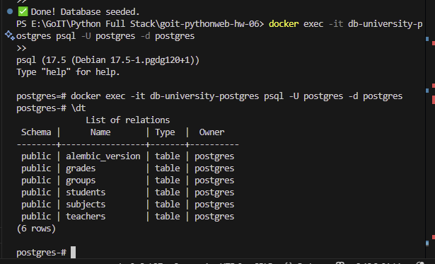
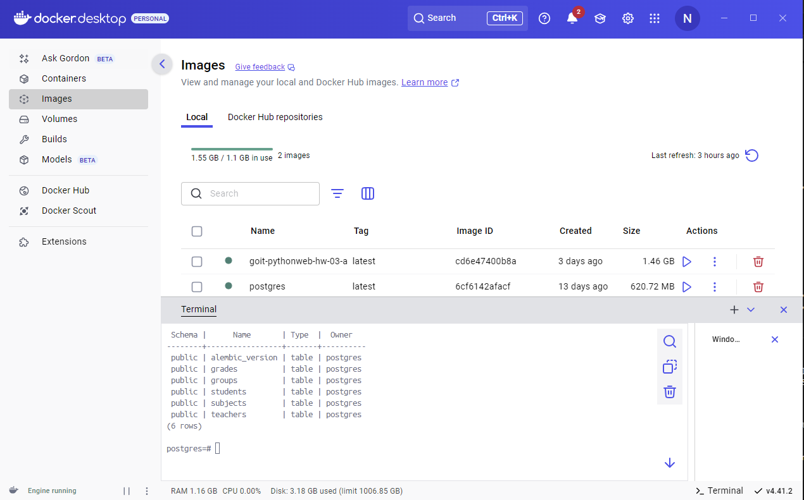

# GoIT Python Web HW06

Цей репозиторій містить рішення **Домашнього Завдання №6** з курсу **GoIT Python Web**.

---

## Опис

Реалізовано базу даних для управління:
- студентами,
- групами,
- викладачами,
- предметами,
- оцінками студентів за предметами.

Використано **PostgreSQL**, **SQLAlchemy** для ORM і **Alembic** для міграцій.

---

## Технології

- Python 3.10+
- PostgreSQL
- SQLAlchemy
- Alembic
- Faker

---

## Запуск Docker з PostgreSQL

У терміналі виконайте:

```bash
docker run --name my_postgres_hw06 -p 5432:5432 -e POSTGRES_PASSWORD=mysecretpassword -d postgres
```

---

## Висновок виконаної роботи

- **Таблиці в базі даних PostgreSQL після міграцій та наповнення**
  

- **Контейнер і образи PostgreSQL у Docker Desktop**
  


